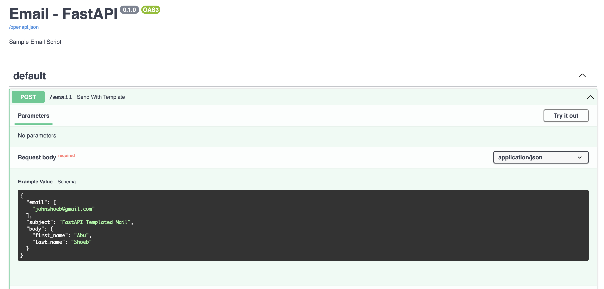
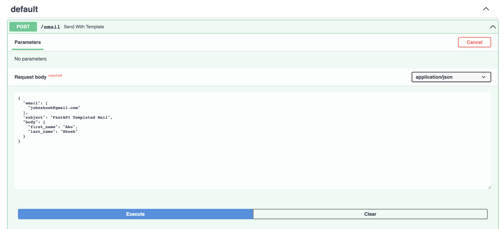
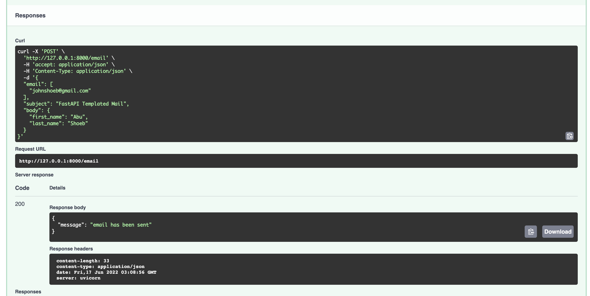

# FastAPI Email Sample Code

## Installation
```
pip install fastapi
```

## Run app
```
uvicorn send_email:app --reload --port 8000
```

## Access API Docs
[http://127.0.0.1:8000/docs](http://127.0.0.1:8000/docs)

## Send email using curl
```
curl -X 'POST' \
  'http://127.0.0.1:8000/email' \
  -H 'accept: application/json' \
  -H 'Content-Type: application/json' \
  -d '{
  "email": [
    "your-email-addess"
  ],
  "subject": "FastAPI Templated Mail",
  "body": {
    "first_name": "Your First Name",
    "last_name": "Your Last Name"
  }
}'
```

## Send email using email endpoint
**Step 1:** Click on email endpoint and hit Try It Out button



**Step 2:** Hit Execute button



**Step 3:** See success response

